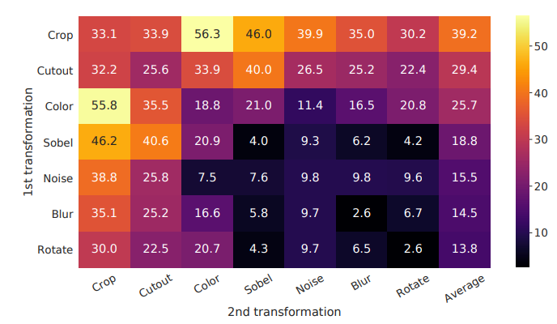

# Deep Learning for Irrigation Detection
## UC Berkeley - MIDS Capstone Fall 2020
### Jade, Jay, Maria, Tom

## Overview
The intent of our work is to develop a deep neural network that will be pre-trained on Sentinel-2 Multi-spectral Satellite Imagery (MSI) from the agricultural regions of California that can be finetuned with limited data to accurately predict irrigated lands. We will use unsupervised techniques inspired by [SimCLR](https://arxiv.org/pdf/2002.05709.pdf) and [SimCLRv2](https://arxiv.org/pdf/2006.10029.pdf) from Google. These techniques have been developed and demonstrated on normal 3-channel (i.e., RGB data) for ImageNet style imagery. The clear differences between MSI (10+ channels) and ImageNet images introduce some challenges in extrapolating the SimCLR techniques to MSI data. These challenges are predominantly focused around identifying effective augmentation techniques that can be implemented as part of the contrastive learning methodology employed by the SimCLR technique. In the original [SimCLR paper](https://arxiv.org/pdf/2002.05709.pdf) numerous evaluations of different augmentation techniques and magnitudes of augmentations were performed in order to determine the best subset of augmentations to use in order to maximize model accuracy with minimal labeled data. In order to do this they evaluated a range of augmentation techniques individually and evaluated the Top-1 Accuracy on ImageNet. The results are shown in the Figure below. There were two main conclusions from this study:  1. No single augmentation technique was sufficient to achieve the accuracy they were after (i.e., > 70%) and  2. color distortion appeared the most effective augmentation technique studied.



These studies took significant compute resources which are unavailable to our team, so we start our evaluations by evaluting only the data augmentation techniques determined to be most important based on the previous work on ImageNet while acknowledging differences in our imagery data. We look at geometric modifications such as rotations, flips, shifts and zooms, color distortion (some of the techniques are only applied to the RGB channels, others on all channels), and Gaussian blurring.

## Training
Follow the steps below for setting up the appropriate environment for model training.

1. Requisition a GPU with > 1TB additional mounted disk. Ideally a V100 as it trains 3x faster than a P100.
2. ssh to this GPU and perform the following. and connect to cloud storage (S3Fuse was used). You can use the commands below to install S3Fuse on an IBM Cloud device.
```
sudo apt-get update
sudo apt-get install -y automake autotools-dev g++ git libcurl4-openssl-dev libfuse-dev libssl-dev libxml2-dev make pkg-config
git clone https://github.com/s3fs-fuse/s3fs-fuse.git
ls
cd s3fs-fuse
./autogen.sh
./configure
make
sudo make install

Substitue your values for <Access_Key_ID> and <Secret_Access_Key> in the below command.
echo "<Access_Key_ID>:<Secret_Access_Key>" > $HOME/.cos_creds
chmod 600 $HOME/.cos_creds

pip install --upgrade s3cmd

# Sub your access keys in the config file below
cat >.s3cfg << eof
 [default]

access_key = <Access_Key_ID>
secret_key = <Secret_Access_Key>
gpg_command = /usr/local/bin/gpg
# host_base = s3.private.us-south.cloud-object-storage.appdomain.cloud
# host_bucket = %(bucket)s.s3.private.us-south.cloud-object-storage.appdomain.cloud
host_base =s3.private.us-east.cloud-object-storage.appdomain.cloud
host_bucket = %(bucket)ss3.private.us-east.cloud-object-storage.appdomain.cloud
use_https = True
eof


```
3. Clone this GitHub repo
4. Navigate to this repo `cd capstone_fall20_irrigation`
5. Build the docker image using the command:  `docker build -t irgapp -f ./setup/tf23.docker .`
6. Run the docker container interactively passing in the GitHub repo and the mounted files from cloud storage:  
`nvidia-docker run -it --rm -v /root/capstone_fall20_irrigation:/capstone_fall20_irrigation -v /mnt/irrigation.data:/data irgapp bash`
7. From within the docker container, copy the necessary clouds from cloud storage to the `/root/capstone_fall20_irrigation/BigEarthData/tfrecords` directory
8. The #6 command command will place you within the docker container. Train the model using the following:  
`python3 supervised_classification.py -a ARCH -o OUTPUT -e EPOCHS -b BATCH -g AUGMENT`
 where ARCH is 'InceptionV3', 'ResNet50', 'Xception', or 'ResNet101V2'
                 OUTPUT is a prefix for model file and results file
                 EPOCHS is number of epochs to run (50 is default)
                 BATCH is batch size (default is 32). 
                 AUGMENT is True or False (whether to use data augmentation).
                 
## Notes on Data Augmentation
Data augmentation is tested on our supervised model to ensure that:
1. the pipeline works (making it easier to implement in our unsupervised model)
2. gather insight into the effectiveness of different techniques with msi data

What we are looking for is data augmentation techniques that at the very least 'do no harm' to our supervised baseline. If we implement data augmentation techniques that make our model perform worse, it would be indicative of the fact that we are destroying important information in our inputs. We expect that techniques that work for supervised learning should also work for unsupervised learning, but the magnitude of the augmentation may need to be tuned as discussed in the [SimCLR paper](https://arxiv.org/pdf/2002.05709.pdf).

                 
           


