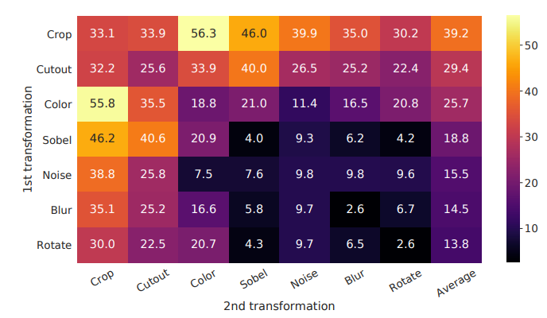
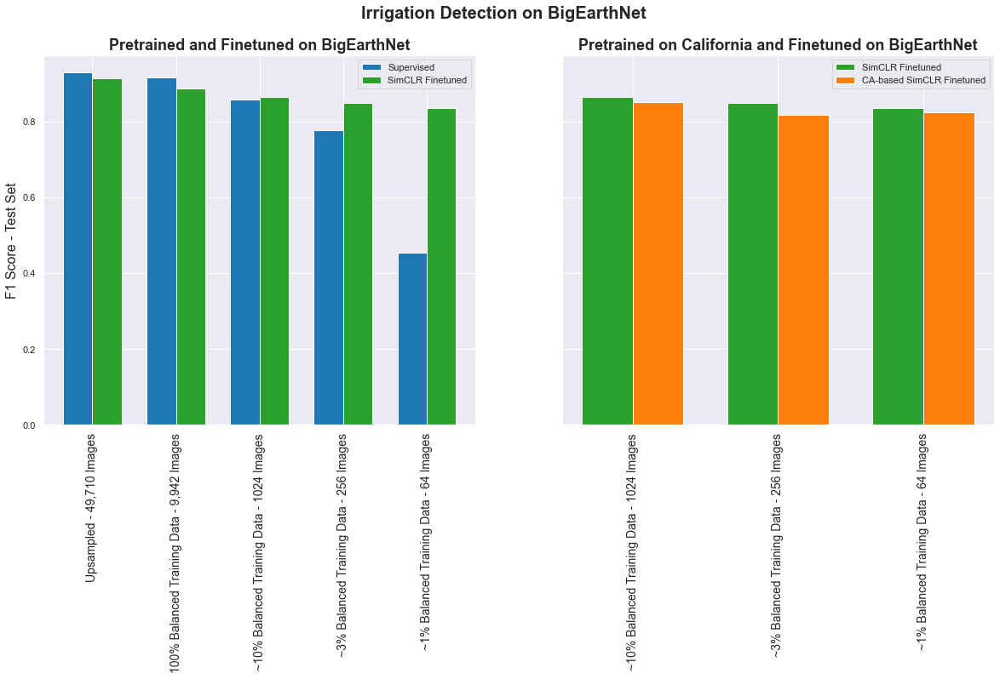
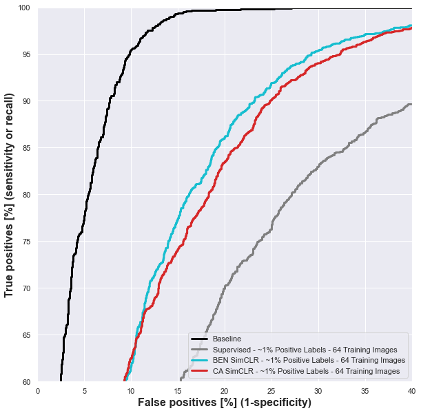
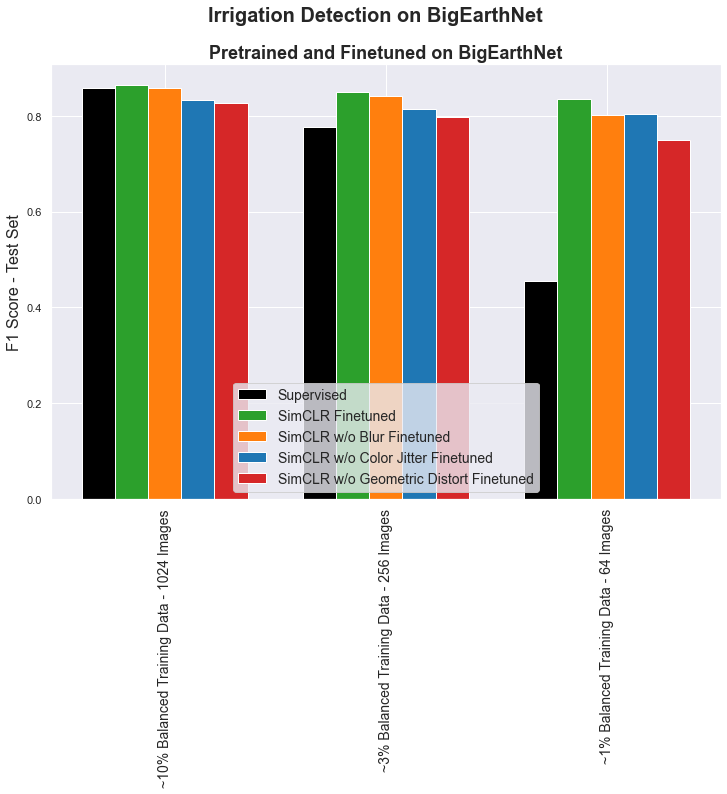
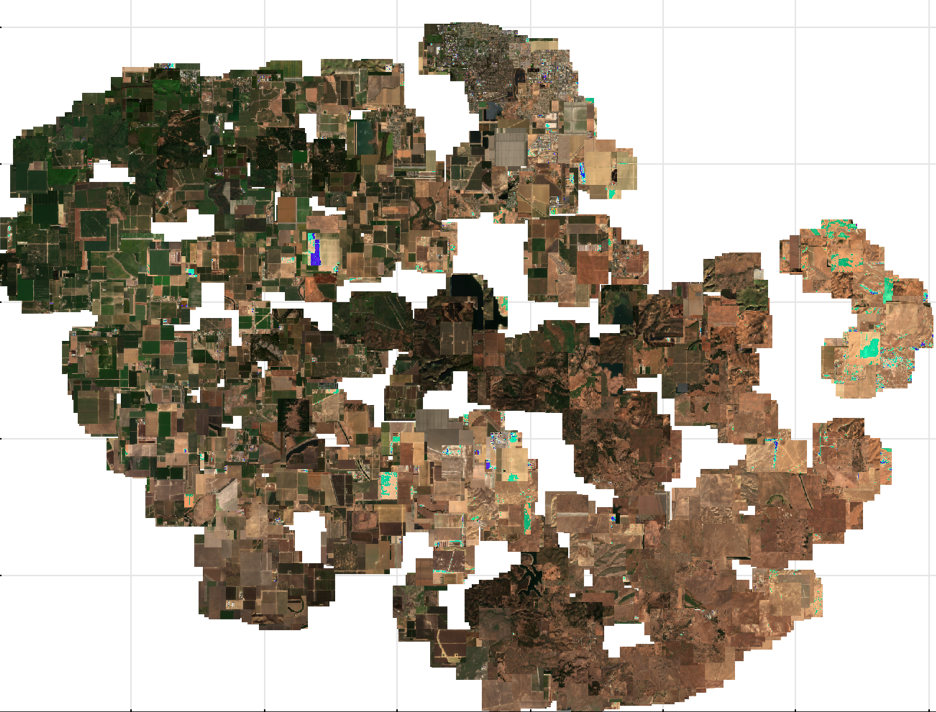
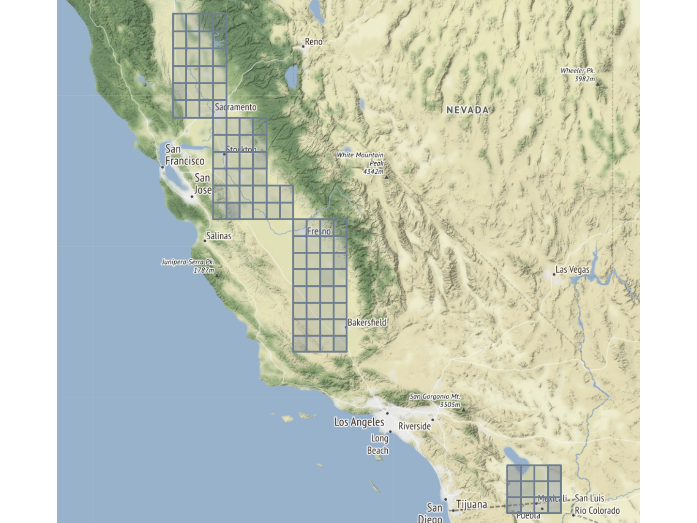

# Deep Learning for Irrigation Detection
## MIDS Capstone Spring 2021
Extended Project From UC Berkeley - MIDS Capstone Fall 2020 (Jade, Jay, Maria, Tom)  [web sitesl](https://people.ischool.berkeley.edu/~mariaauslander/index.html) 
Current team: Ernesto, Ken, Surya, Taeil (instructors: Puya, Alberto) 

## Overview
The intent of our work is to develop a deep neural network that will be pre-trained on Sentinel-2 Multi-spectral Satellite Imagery (MSI) from the agricultural regions of California that can be finetuned with limited data to accurately predict irrigated lands. We will use unsupervised techniques inspired by [SimCLR](https://arxiv.org/pdf/2002.05709.pdf) and [SimCLRv2](https://arxiv.org/pdf/2006.10029.pdf) from Google. These techniques have been developed and demonstrated on normal 3-channel (i.e., RGB data) for ImageNet style imagery. The clear differences between MSI (10+ channels) and ImageNet images introduce some challenges in extrapolating the SimCLR techniques to MSI data. These challenges are predominantly focused around identifying effective augmentation techniques that can be implemented as part of the contrastive learning methodology employed by the SimCLR technique. In the original [SimCLR paper](https://arxiv.org/pdf/2002.05709.pdf) numerous evaluations of different augmentation techniques and magnitudes of augmentations were performed in order to determine the best subset of augmentations to use in order to maximize model accuracy with minimal labeled data. In order to do this they evaluated a range of augmentation techniques individually and evaluated the Top-1 Accuracy on ImageNet. The results are shown in the Figure below. There were two main conclusions from this study:  1. No single augmentation technique was sufficient to achieve the accuracy they were after (i.e., > 70%) and  2. color distortion appeared the most effective augmentation technique studied.



These studies took significant compute resources which are unavailable to our team, so we start our evaluations by evaluting only the data augmentation techniques determined to be most important based on the previous work on ImageNet while acknowledging differences in our imagery data. We look at geometric modifications such as rotations, flips, shifts and zooms, color distortion (some of the techniques are only applied to the RGB channels, others on all channels), and Gaussian blurring.

Following on the work discussed in the [SimCLRv2 paper](https://arxiv.org/pdf/2006.10029.pdf), we consider that a deep, narrow network such as ResNet101 may lead to improved performance over shorter, wider networks. This is where our SimCLR evaluations began. As noted above we apply geometric, color and blur augmentations with random chances of 100%, 80% (20% for color dropping) and 50%, respectively - consistent with the SimCLR literature. We then perform sensitivities about these baseline parameters to determine whether more optimized augmentation hyperparameters exist for our MSI data. In our initial training, loss was not significantly reduced implying learning was minimal during training. We hypothesized this might be due to too strong of color jitter being applied. When reducing the color jitter intensity factor by 50%, we could see marked reductions in the contrastive loss during unsupervised training. It is expected that reducing augmentation intensity will naturally reduce the contrastive loss as the postive pairs (i.e., two augmented version of the same image) will be more similar to one another. Thus, finetuning of our model and evaluating against the validation and test sets is also needed to better distinguish between unsupervised models. 

Results from runs of our SimCLR model using 100% of the BigEarthNet training data and then finetuning on 1%, 3% and 10% of the positive class (and equal amount of negative class) images are shown in the figure below (left-hand side). The figure clearly shows a significant benefit from the SimCLR pretraining when training when using less than 10% of the positive class training examples. In fact with only 64 total images in finetuning, we see a marked increase in F1-score of ~0.4 absolute relative to a supervised baseline model. These results indicate that this technique may greatly reduce the need for labeled MSI data while also producing reasonably accurate results. However, results are still not as good as the supervised baseline. 

Separately we have also developed an independent dataset of Sentinel-2 satellite imagery focused on the agricultural regions of the state of California (see the [ca_data_qa notebook](CaliforniaData/) in the CaliforniaData directory for visualization of this data - note that this notebook was created to run in Google Colaboratory environment where our California Dataset lives). We pretrain a SimCLR model using this other dataset, hoping to learn extensible features from our satellite imagery. We then finetune this California based SimCLR model using the BigEarthNet data and still see significant benefits from this non-geographically specific pretraining. This is also an encouraging result suggesting that perhaps region-specific data sets are not required for getting significant value from pretraining. These results are shown in the lower right-hand figure. The test set performance in terms of area under the ROC curve are also shown below. Finally we also perform an ablation study similar to that performed in the original SimCLR study to determine which augmentation techniques are individually most important to model performance. These results are shown in the third image below. The results are generally inline with previous results and indicate that multiple independet augmentations are desirable and the order of importance of individual augmentations are as follow:
1. Geometric Distorion in most important
2. Color Distortion is quite effective and complements Geometric distortion
3. Gaussian Blur has a small impact 





The results above show that we benefit from pretraining on the California data and extending these learned encoder weights to the BigEarthNet data. We have no labeled data for California, and thus cannot finetune on CA specifically. So the above study was performed to objectively show that our California pretraining was successful. In addition, we have generated a t-SNE grid plot for a subset of our California data. An example of this for 2,048 of our California images is shown below. There is also a notebook to create interactive bokeh grids included in the [notebooks folder](notebooks/). In the tSNE plot, images are first fed through the pretrained SimCLR neural encoder and projection head. The resultant 128 dimension array for each image is then passed into a tSNE algorithm to reduce the number of dimensions to two - or x and y coordinates. Each image is thus placed based on how close its encoded latent space vector is to those from other images. In this way we are showing the benefit of the pretraining. Images that have similar features are arranged more closely. For example in the top left of the plot, all of the images with predominantly heavily green vegetation are located. Conversely the more arid, mountainous images are located in the opposite, lower-right corner. Finally satellite images with more urban settings are located in the top center of the grid.



## Supervised Baseline Training - BigEarthNet Data

#### Irriation Detection (binary classification)
The BigEarthNet data was first used to establish a supervised baseline to demonstrate the effectiveness of using deep learning for irrigation detection. Further this supervised baseline was then used as a point of reference to compare different self-supervised training methodologies (e.g., augmentation techniques, neural backbone architecture, finetune strategies, etc.). The supervised baseline was established through evaluations of several neural model architectures (InceptionV3, ResNet50, Xception, ResNet101V2), hyperparameter evaluations and techniques to accommodate the class imbalance in the BigEarthNet data set, as previously mentioned.
The final supervised benchmark model consisted of all negative training examples downsampled at a rate of 19 or ??. The AUC was determined to be approximately 0.97 for both balanced test dataset (50/50 split of positive and negative examples) and skewed test dataset (10/90 split of positive and negative examples). In addition to establishing a baseline using the downsampled dataset, an evaluation was performed to show how supervised model performance drops with a reduction in labeled data. These results are shown in Figures \ref{fig:sup_auc} and \ref{fig:sup_f1} in terms of the receiver operating characteristic curves and F1-scores, respectively.

**Optimization Hyperparameters**
- fixed: batch size 32/64
- hyperparameters 
	- architecture: InceptionV3, ResNet50, Xception, ResNet101V2
	- epochs ~100 (with early stopping based on AUC)
	- training set: 1% 3% 5% 10%, 100%
	- downsampling: 50/50, 10/90
	- upweighting: enable, disable
	- output activation: sigmoid, ReLu, tanh, softmax

**Binary Classification AUC (F1-score)**

|  | 50/50 | 10/90 | no downsample | 
| ----- | ----- | ----- | -------- | 
| 1% | 0.8454 (0.09001) | 0.8934 (0.153) | 0.5 (0) | 
| 3% | 0.9043 (0.1596) | 0.9214 (0.2845) |  0.8149 (0) | 
| 5% | 0.9231 (0.2421) | 0.9439 (0.3004) | 0.8845 (0) | 
| 10% | 0.9448 (0.2515) | 0.9323 (0.255) | 0.9132 (0) | 
| 100% | 0.9648 (0.3148) | 0.973 (0.5296) | 0.9731 (0.478) | 

Figure: AUC and F-1 score performance on test set varying the number of training set (positive samples) and downsamping factors. Result is also available [W&B daishboard](https://wandb.ai/taeil/irrigation_detection)  

#### Multi-Class Classification

**Optimization Hyperparameters** 
- fixed: no downsampling, sigmoid as output activation, sgd for optimizer, categorical crossentropy as loss function  
- hyperparameters
	- architecture: InceptionV3, ResNet50, Xception, ResNet101V2

**Multi-class Classification F1-score (P / R)**

|   | no downsample | 
| ----- | -------- | 
| 1% | 0.6447 (0.6888/0.606) | 
| 3% | 0.6664 (0.7113/0.6268)| 
| 5% | 0.6884 (0.767/0.6245) | 
| 10% | 0.7147 (0.79/0.6525) | 
| 100% | 0.7499 (0.7965/0.7085)  | 

Figure: F-1 score performance on test set varying the number of training set. Result is also available [W&B daishboard](https://wandb.ai/cal-capstone/bigearthnet_classification)  

#### To Reproduce 
1. Follow the [setup](references/setup.md) and [data pipeline](references/ML_pipeline.md) to prepare the docker container and datasets.
2. Train the model using the following command. 
	```
	pip install --upgrade wandb
	wandb login <your wandb apikey>
	python train_supervised.py -a ARCH -e EPOCHS -b BATCH -p PERCENT -d DOWNSAMPLE -t TEST -c CLASSES
	``` 
	- *ARCH* is `InceptionV3`, `ResNet50`, `Xception`, or `ResNet101V2`
	- *EPOCHS* is number of epochs to run (50 is default)
	- *BATCH* is batch size (default is `32`). 
	- *AUGMENT* is `true` or `false` (whether to use data augmentation). (augment is not supported as of now) 
	- *PERCENT* is the portion of dataset to be used for training and validation
	- *TEST* is `true` or `false` (whether to run evaluation on the test set with the trained model at the end)
	- *DOWNSAMPLE* is to pick datasets which has been downsampled. `50/50`, `10/90`, or `no`. 
	- *CLASSES*: `1` (binary classification for irrigation land) or `43` (multi-class calssficiation)  
	- For example, the following command will train a model with 50 epochs, 32 batch size, no augmentation, 10% of 50/50 downsampled set with test evaluation on binary classification. 
		```
		python train_supervised.py -a InceptionV3 -e 50 -b 32 -g 0 -p 10 -d 50/50 -t 1 -c 1
		```  

## Notes on Data Augmentation
Data augmentation is tested on our supervised model to ensure that:
1. the pipeline works (making it easier to implement in our unsupervised model)
2. gather insight into the effectiveness of different techniques with msi data

What we are looking for is data augmentation techniques that at the very least 'do no harm' to our supervised baseline. If we implement data augmentation techniques that make our model perform worse, it would be indicative of the fact that we are destroying important information in our inputs. We expect that techniques that work for supervised learning should also work for unsupervised learning, but the magnitude of the augmentation may need to be tuned as discussed in the [SimCLR paper](https://arxiv.org/pdf/2002.05709.pdf).

## SimCLR Model Training - BigEarthNet Data
1. Follow the setup instructions in the Readme in the Setup Folder to install the docker container.
2. Run the docker container interactively passing in the mounted files from cloud storage:  
`nvidia-docker run -it --rm -v /mnt/irrigation_data:/data irgapp bash`
3. From within the docker container, copy the necessary clouds from cloud storage to the `/root/capstone_fall20_irrigation/BigEarthData/tfrecords` directory
4. The #6 command command will place you within the docker container. Train the model using the following:  
`nohup python simclr.py -a ARCH -o OUTPUT -e EPOCHS -b BATCH -t TEMPERATURE -c CALIFORNIA&`
 where ARCH is 'InceptionV3', 'ResNet50', 'Xception', or 'ResNet101V2'
                 OUTPUT is a prefix for model file and results file
                 EPOCHS is number of epochs to run (50 is default)
                 BATCH is batch size (default is 32). 
                 TEMPERATURE is the temperature used in the contrastive loss function (default 0.1)
                 CALIFORNIA is True or False and specifies whether to train on California data (True) or BigEarthNet data (False).
 5. The above command will run the python script in background which will allow for grabbing model files as soon as they are saved. You can watch the progress by using the command below.
 ```
 tail -f nohup.out
 ```

## Fine-tuning of Pre-trained Model
1. Finetuning is done with small subsets of the actual training data. To date two subsets have been created - one with 13% of positive class images and one with ~2.7% of positive class images. These break points were chosen as they are compatible with batch sizes of 32. The 13% balanced training set (i.e. equal number of positive and negative example) contains 640 total image (320 positive and negative). The 3% balanced training set contains only 128 total images (64 of each class).
2. Due to the small training set sizes, the finetuning has been performed locally, but could easily be performed using the same docker container above.
3. During the finetuning, the SimCLR neural encoder and first two layers of the projection head are used with all weights frozen.
4. Two additional MLP layers were added and trained during the finetuning. The size of these layers is nominally set to 256, but we treat these sizes as a hyperparameter.
5. Initial studies were performed with 25% dropout following each MLP layer and a default Adam Optimizer learning rate of 1e-3.
6. Following initial trials it was observed that the learning rate should be reduced to provide for more stable learning (as expected). We currently finetune with a learning rate of 1e-4 and 50% dropout.
7. You can use the following command to run the finetuning:
```
python finetune.py -p PRETRAIN -t TRAINING_SET -o OUTPUT -e EPOCHS -b BATCH_SIZE -c CLASS
```
where PRETRAIN is the filename of the pretrained simclr model (should reside in ./BigEarthData/models directory)
      TRAINING_SET is either balanced_train_3percent.tfrecord or balanced_train_13percent.tfrecord (files should be in ./BigEarthData/tfrecords directory)
      OUTPUT is the output filename prefix
      EPOCHS is the number of epochs to finetune for - 10 is the default but we find that with the 1e-4 learning rate, 20-30 may be better. Early stopping is employed with patience of 15 epochs
      BATCH_SIZE is the batch size to use during training with a default of 32.
      CLASS is either Irrigation or Vineyards and specifies which class to finetune on
8. The above script will train and store a keras model file and a pickled data frame with epoch-wise training and validation metrics that can be plotted with the epoch_metrics notebook in the ./notebooks directory

## California Data Set
Sentinel-2 Level2A satellite imagery is gathered for the state of California using the Google Earth Engine API. The code to extract the MSI data and write to a TIF file can be found in the gather_california_data.ipynb notebook in the [notebooks directory](notebooks/). The data gathered was focused on agricultural regions of California - primarily the Central Valley, but also the souther region near Calexico as well. Patches of MSI data are gathed in 0.25 degree by 0.25 degree increments. This is roughly 600 square kilometers. In total 96 patches have been gathered, all for 2019 but for random months. This amounts to ~58,000 square kilometers, or roughly 14% the land area of California. The areas covered in our data set so far are shown in the image below.



Each image patch is approximately 3458 x 2784 pixels. For consistency with the Big Earth Net data these patches are then tiled into 120 x 120 images, resulting in >600 image tiles per patch, and approximately 64,000 total images for training our California-based SimCLR model. Images are checked to ensure there are no NaNs. If NaNs exist anywhere in the image, the image is thrown out. In some cases when gathering the satellite imagery, it was notice that large swaths of a region were unavailable (likely due to continuous cloud cover). In those cases, an attempt was made to find a month that was more fully available. Each patch was visually inspected to ensure that data was acceptable. This quality assurance was perfomed using the [ca_data_qa notebook](CaliforniaData/) in the CaliforniaData directory. An example of this visual quality assurance is provided below, where the agricultural index for 32 contiguous patches are shown. As discussed [here](https://gisgeography.com/sentinel-2-bands-combinations/)
The agriculture band combination uses SWIR-1 (B11), near-infrared (B8), and blue (B2). It’s mostly used to monitor the health of crops because of how it uses short-wave and near-infrared. Both these bands are particularly good at highlighting dense vegetation which appears as dark green. The different shadings by patch are an artifact of using the same scaling factor to adjust the reflectance of each image prior to plotting. This and the fact that different patches represent different months (with different vegetation levels) make it relatively easy to see where patch boundaries occur.


#### Project Organization
------------

    ├── LICENSE
    ├── Makefile           <- Makefile with commands like `make data` or `make train`
    ├── README.md          <- The top-level README for developers using this project.
    ├── data
    │   ├── external       <- Data from third party sources.
    │   ├── interim        <- Intermediate data that has been transformed.
    │   ├── processed      <- The final, canonical data sets for modeling.
    │   └── raw            <- The original, immutable data dump.
    │
    ├── docs               <- A default Sphinx project; see sphinx-doc.org for details
    │
    ├── models             <- Trained and serialized models, model predictions, or model summaries
    │
    ├── notebooks          <- Jupyter notebooks. Naming convention is a number (for ordering),
    │                         the creator's initials, and a short `-` delimited description, e.g.
    │                         `1.0-jqp-initial-data-exploration`.
    │
    ├── references         <- Data dictionaries, manuals, and all other explanatory materials.
    │
    ├── reports            <- Generated analysis as HTML, PDF, LaTeX, etc.
    │   └── figures        <- Generated graphics and figures to be used in reporting
    │
    ├── requirements.txt   <- The requirements file for reproducing the analysis environment, e.g.
    │                         generated with `pip freeze > requirements.txt`
    │
    ├── setup.py           <- makes project pip installable (pip install -e .) so src can be imported
    ├── src                <- Source code for use in this project.
    │   ├── __init__.py    <- Makes src a Python module
    │   │
    │   ├── data           <- Scripts to download or generate data
    │   │   └── make_dataset.py
    │   │
    │   ├── features       <- Scripts to turn raw data into features for modeling
    │   │   └── build_features.py
    │   │
    │   ├── models         <- Scripts to train models and then use trained models to make
    │   │   │                 predictions
    │   │   ├── predict_model.py
    │   │   └── train_model.py
    │   │
    │   └── visualization  <- Scripts to create exploratory and results oriented visualizations
    │       └── visualize.py
    │
    └── tox.ini            <- tox file with settings for running tox; see tox.readthedocs.io


--------

<p><small>Project based on the <a target="_blank" href="https://drivendata.github.io/cookiecutter-data-science/">cookiecutter data science project template</a>. #cookiecutterdatascience</small></p>
